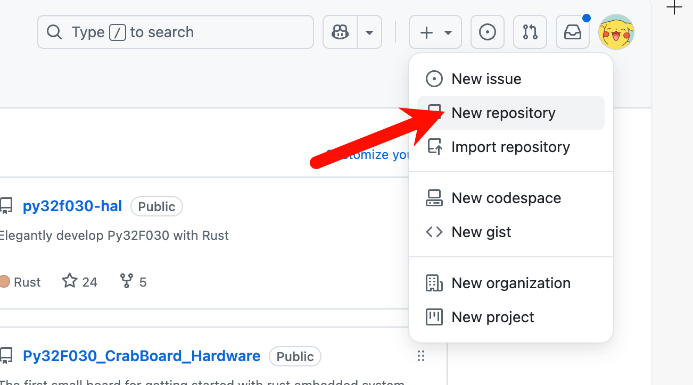
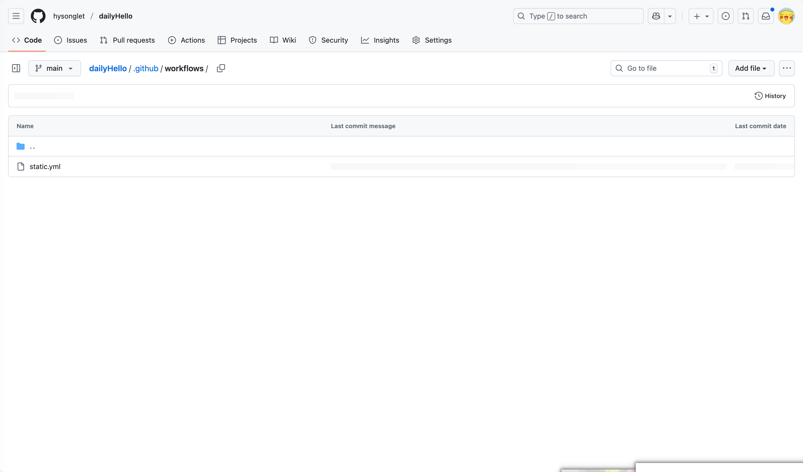

# 使用github添加自己写的网页并发布到互联网上
移动应用开发班级素材

## 创建github的账号

https://github.com/
## 创建一个仓库

## 提交你的网页，网页的根文件为 index.html

## 在仓库的设置中找到github pages，选择master分支，点击保存
1. 进入仓库后按照图示顺序点击选项

## 在浏览器中输入你的github账号名.github.io/仓库名，就可以访问你的网页了
如：https://hysonglet.github.io/dailyHello/